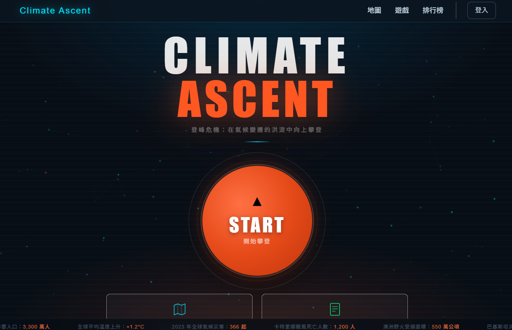

# Climate Ascent 氣候攀登者

**<a href="https://extreme-weather-red.vercel.app/" target="_blank">🔗 專案連結 (Live Demo)</a>**

**Climate Ascent** 是一個結合「極端氣候數據探索」與「體感互動遊戲」的網頁應用程式。我們以聯合國永續發展目標 **SDG 13 (Climate Action 氣候行動)** 為核心理念，邀請使用者化身氣候時代的攀登者，透過互動體驗來理解地球正在發出的警訊。

## 📸 畫面預覽 (Screenshots)

<a href="https://extreme-weather-red.vercel.app/" target="_blank">
  
</a>
*專案首頁畫面*

## 🌟 核心功能 (Features)

本專案提供兩大主要體驗入口：

1. **📊 氣候儀表板 (Dashboard - Explore)**
   * **互動資料視覺化**：透過地圖與儀表板，探索全球的極端氣候事件數據。
   * **趨勢分析**：深入了解氣候變遷帶來的影響與長期趨勢。

2. **🕹️ 攀登遊戲 (Ascent - Play)**
   * **垂直跳躍闖關**：化身氣候攀登者，在不斷變化的氣候時代中向上躍進。
   * **AI 互動體驗**：結合 Mediapipe 影像辨識技術，透過肢體動作與遊戲互動。
   * **排行榜與個人檔案**：挑戰極限，與其他玩家競爭最高分數，並管理您的成就！

## 🛠️ 技術架構 (Tech Stack)

* **前端 (Frontend)**:
  * Vue 3 & Vite
  * Pinia (狀態管理)
  * Vue Router (路由管理)
  * @mediapipe/tasks-vision (AI 視覺/手勢互動)
  * Axios

* **後端 (Backend)**:
  * Node.js & Express.js
  * PostgreSQL & Sequelize (關聯式資料庫與 ORM)
  * JWT & bcrypt (使用者身分驗證)
  * Google Auth Library (第三方登入)

## ☁️ 部署服務 (Deployment)

* **前端部署**: Vercel
* **後端部署**: Render
* **資料庫**: Neon (Serverless Postgres)

## 📂 專案架構 (Project Structure)

```text
extreme_weather/
├── frontend/                # 前端應用程式 (Vue 3 + Vite)
│   ├── src/                 # 原始碼目錄
│   │   ├── assets/          # 靜態資源 (圖片、樣式等)
│   │   ├── components/      # 可重複使用的 Vue 元件
│   │   ├── data/            # 靜態資料 (氣候數據等)
│   │   ├── router/          # 路由設定 (Vue Router)
│   │   ├── stores/          # 全域狀態管理 (Pinia)
│   │   ├── views/           # 頁面級別元件 (Home, Dashboard, Game 等)
│   │   ├── App.vue          # 主 Vue 元件
│   │   └── main.js          # 應用程式入口
│   └── package.json         # 前端依賴套件配置
│
└── backend/                 # 後端 API 伺服器 (Node.js + Express)
    ├── api/                 # API 路由與控制器邏輯
    ├── uploads/             # 上傳檔案暫存區
    ├── db.js                # 資料庫連線與模型設定 (Sequelize)
    ├── index.js             # 伺服器進入點
    └── package.json         # 後端依賴套件配置
```

## 🚀 專案連結
馬上體驗：**<a href="https://extreme-weather-red.vercel.app/" target="_blank">https://extreme-weather-red.vercel.app/</a>**
